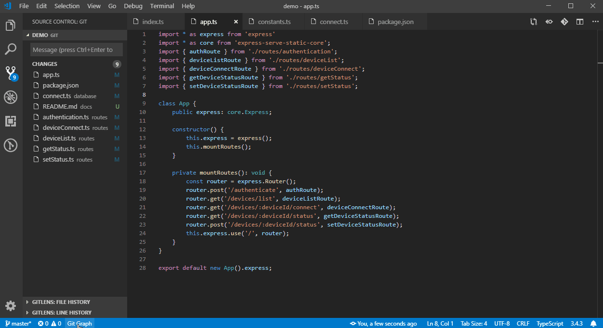

  
  <samp>
    <h1>Git Graph Alter for Visual Studio Code</h1>
    <h3>An MIT fork of Git Graph. Visual history, branch actions, and devcontainer support.</h3>
  </samp>

<!--
  Badges use the `your-org` / `your-publisher` placeholders.
  Replace them with your GitHub owner and Marketplace publisher id before publishing.
-->

&nbsp;

## Why this fork

**Git Graph Alter** is an MIT-licensed fork built on top of
[(neo) Git Graph](https://github.com/asispts/neo-git-graph) by Asis Pattisahusiwa,
which is itself a clean MIT fork of the original
[Git Graph](https://github.com/mhutchie/vscode-git-graph) by Michael Hutchison.

The original Git Graph changed its license in May 2019 — everything after
[commit 4af8583](https://github.com/mhutchie/vscode-git-graph/commit/4af8583a42082b2c230d2c0187d4eaff4b69c665)
is no longer MIT. This fork is based on the last MIT commit (via (neo) Git Graph),
so the entire lineage stays MIT.

This fork:

- Keeps the MIT license
- Adds devcontainer support
- Adds internationalization support (English, zh-CN, zh-TW)
- Improves codebase, tooling, and maintainability

## Features

- **Graph view**: See branches, tags, and uncommitted changes in one graph
- **Commit details**: Click a commit to see message, files, and diffs
- **Branch actions**: Create, checkout, rename, delete, and merge
- **Tag actions**: Create, delete, and push tags
- **Commit actions**: Checkout, cherry-pick, revert, and reset
- **Avatar support**: Optional avatars from GitHub, GitLab, or Gravatar
- **Multi-repo**: Work with multiple repositories in one workspace
- **Devcontainer ready**: Works in remote and container environments

## Configuration

All settings live under the `git-graph-alter.*` prefix. The easiest way to
configure the extension is the Settings UI — open Settings and search for
**Git Graph Alter**.

A few commonly adjusted settings:

| Setting                                      | Default       | Description                                      |
| -------------------------------------------- | ------------- | ------------------------------------------------ |
| `git-graph-alter.history.fetchAvatars`       | `false`       | Fetch avatars (sends email to external services) |
| `git-graph-alter.dates.format`               | `Date & Time` | Date format shown in the date column             |
| `git-graph-alter.dates.type`                 | `Author Date` | `Author Date` or `Commit Date`                   |
| `git-graph-alter.graph.edgeStyle`            | `rounded`     | `rounded` or `angular`                           |
| `git-graph-alter.history.initialCommitCount` | `300`         | Commits to load on open                          |
| `git-graph-alter.repoSearchDepth`            | `0`           | Folder depth for repository search               |
| `git-graph-alter.statusBarButton`            | `true`        | Show the status bar button                       |

See `contributes.configuration` in `package.json` for the full list of settings.

## Installation

Search for **Git Graph Alter** (`vscode-git-graph-alter`) in Extensions, or install from:

- [VS Code Marketplace](https://marketplace.visualstudio.com/items?itemName=your-publisher.vscode-git-graph-alter)
- [Open VSX Registry](https://open-vsx.org/extension/your-publisher/vscode-git-graph-alter)

## License

MIT — see [LICENSE](LICENSE).

> Not affiliated with or endorsed by the original Git Graph project or (neo) Git Graph.
</content>
